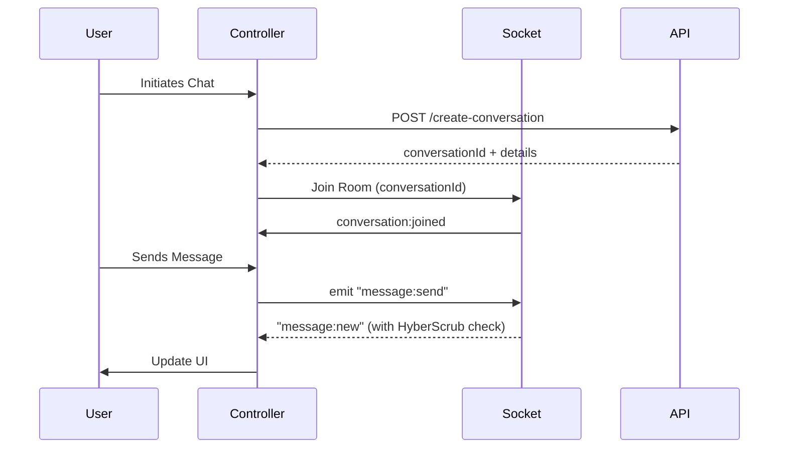

# Developer Documentation: Brahmakosh Astrology & Expert Consultation

## 1. Executive Summary
The Astrology module provides a premium, real-time consultation experience connecting users with Vedic experts. It features a sophisticated state management system using GetX, real-time messaging via Socket.io with intelligent "HyperScrub" deduplication, and a robust consultation lifecycle management.

---

## 2. Architectural Overview

### 2.1 Core Components
- **State Management**: Orchestrated by `AstrologyController` (listings) and `AstrologyChatController` (active sessions).
- **Communication Layer**: `SocketService` facilitates duplex communication for messages, typing status, and online presence.
- **Repository Interface**: `callWebApi` (and variants) handles RESTful interactions with the backend services.

### 2.2 The "HyperScrub" Mechanism
To solve the "double message" problem common in hybrid Socket/REST environments, the app implements a fuzzy deduplication logic:
1. **ID-Based Check**: Matches unique MongoDB/Server IDs.
2. **Fuzzy Contextual Check**: Matches `senderId` + `trimmedContent` + `timeWindow` (within 5 seconds).
3. **Optimistic Sync**: Temporary client-side IDs are replaced seamlessly once server acknowledgment is received.

---

## 3. Screen-by-Screen Breakdown

### 3.1 Expert Listing (`AstrologyExpertsView`)
**Features:**
- **Dynamic Filtering**: Tab-based category selection fetched from `sadhnaServices`.
- **Real-time Status**: Color-coded indicators (Green: Available, Orange: Busy, Grey: Offline).
- **Search Logic**: Multi-field filtering across names, languages, and expertise strings.

**API Endpoints:**
- **GET** `ApiUrls.sadhnaServices`
  - *Purpose*: Fetches category list (e.g., Vedic, Palmistry, Vastu).
- **GET** `ApiUrls.experts`
  - *Purpose*: Fetches experts, optionally filtered by `?category=id`.

### 3.2 Expert Profile (`AstrologistProfileView`)
**Features:**
- **Credibility Indicators**: Displays verified reviews, experience metrics, and "Consults" count.
- **Pre-Consultation Check**: A dedicated balance verification logic ensures users have the minimum required credits before initiating a session.
- **Action Hub**: Quick triggers for Chat, Voice (Coming Soon), and Video (Coming Soon).

**API Endpoints:**
- **GET** `ApiUrls.getProfile`
  - *Purpose*: Validates user's credit balance via `ProfileViewModel`.

### 3.3 Live Consultation UI (`AstrologyChatView`)
**Features:**
- **Contextual Onboarding**: If no messages exist, a topic selector (Career, Wealth, etc.) and pre-defined questions are shown to lower the barrier to entry.
- **Interactive Elements**: Typing indicators and multi-state read receipts (Sent, Delivered, Read).
- **Session Lifecycle**: Real-time timer and a "End Chat" confirmation flow.

**API Endpoints:**
- **POST** `ApiUrls.createConversation`
  - *Purpose*: Initializes a new session or resumes an active one.
- **GET** `/api/chat/conversations/:id/messages`
  - *Purpose*: Syncs full message history for the session.
- **PATCH** `/api/chat/conversations/:id/read`
  - *Purpose*: Synchronizes read status across devices.

### 3.4 Consultation Summary & History (`ConversationHistoryView`)
**Features:**
- **Automated Reporting**: Upon session end, an AI-generated summary, duration metrics, and credit usage report are displayed.
- **Ledger Management**: Status-based filtering (Active, Ended, All).
- **Unread Hub**: Centralized management for unread message counts per conversation.

**API Endpoints:**
- **GET** `ApiUrls.getConversations`
  - *Purpose*: Fetches user's total consultation history.
- **GET** `ApiUrls.unreadCount`
  - *Purpose*: Batched fetch for all unread counts.

---

## 4. Technical Implementation Flow

---

## 5. Key Constants & URLs
- **Chat Base**: `/api/chat`
- **Mobile Base**: `/api/mobile`
- **Consultation Minimum**: 5 minutes credit reserve required.
